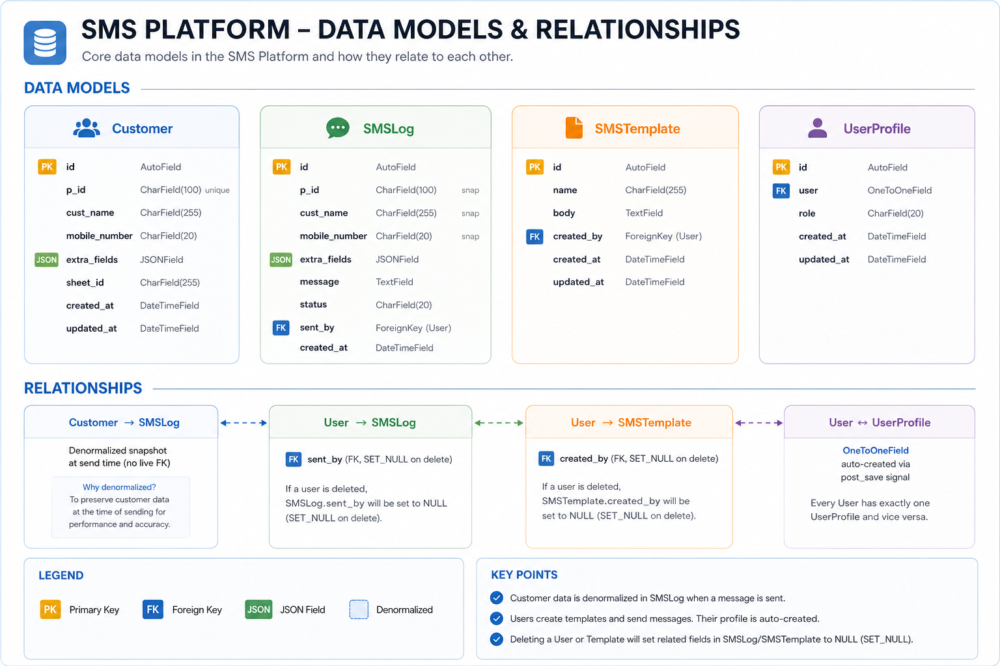
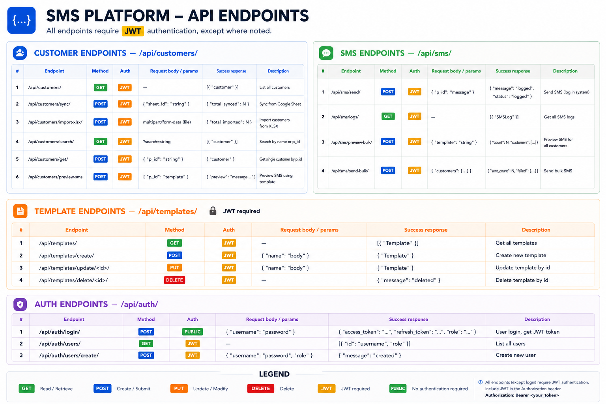
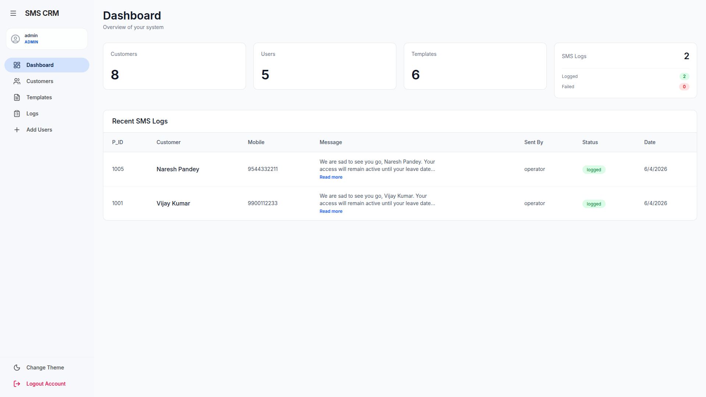
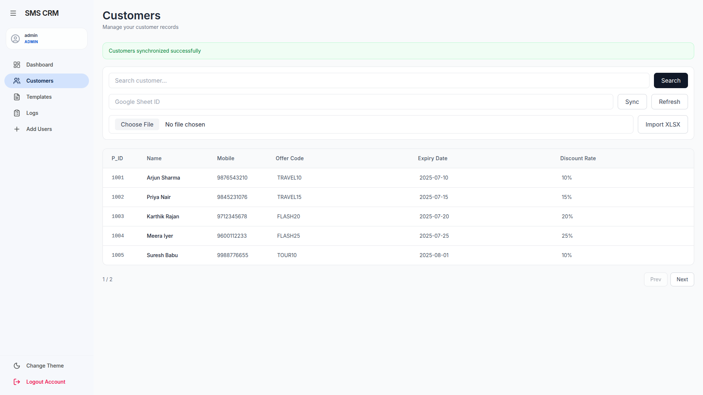
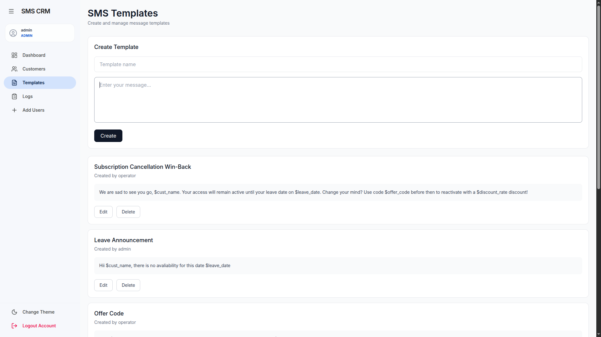
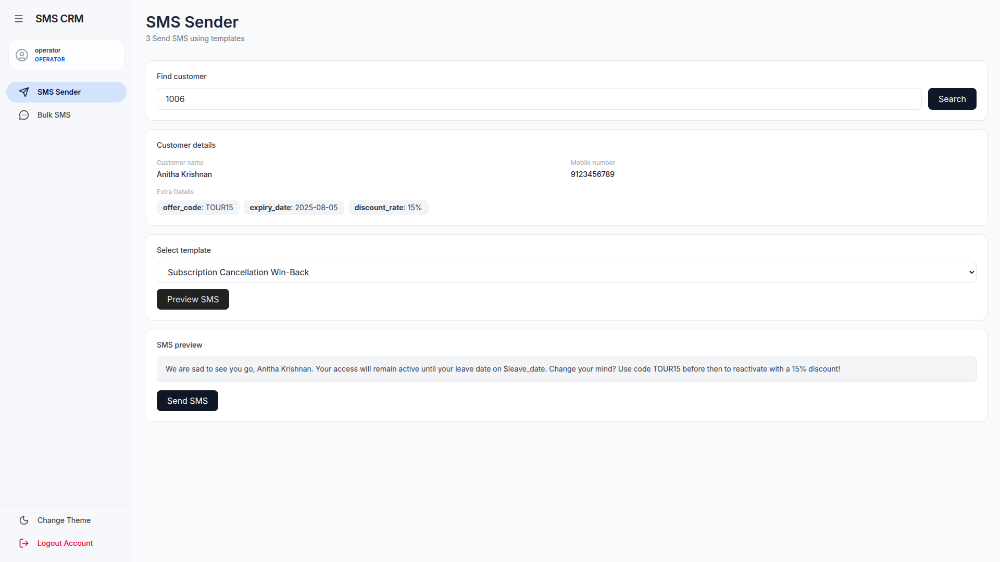

# SMS Automation Web Application

A web app that fetches customer data from Google Sheets and sends personalised SMS messages using templates.

## What it does

1. Operator enters a **Google Sheet ID** and a **P_ID** to look up a customer
2. Customer details are fetched live from the sheet via Google Sheets API
3. Operator picks an SMS template with placeholders (e.g. `{cust_name}`, `{amount}`)
4. A live preview shows the resolved message before sending
5. On send, the message is logged to the database (no real SMS gateway — simulated)

## Roles

| Role     | Access                                                 |
| -------- | ------------------------------------------------------ |
| Admin    | Dashboard, Customers, Templates, Logs, User Management |
| Operator | SMS Sender, Bulk SMS                                   |

## Models and Relation



## API Endpoints



## Tech Stack

* **Frontend** — React.js
* **Backend** — Python (Django + REST Framework)
* **Database** — MySQL
* **Auth** — JWT (access + refresh tokens)
* **Google Sheets** — Sheets API v4 (service account)

## Preview

### Dashboard Preview



### Customer Sync Preview



### Templates Preview



### SMS Sender Preview




## Setup

```bash
# Backend
pip install -r requirements.txt

# Add your Google service account JSON path to .env
python manage.py migrate
python manage.py runserver
```

```bash
# Frontend
npm install
npm run dev
```
