# SMS Automation CRM

> A production-grade, full-stack CRM and communication automation platform —
> built to eliminate manual outreach, centralize customer data, and deliver personalized SMS at scale.

&nbsp;


&nbsp;

---

## Table of Contents

- [Overview](#overview)
- [Tech Stack](#tech-stack)
- [System Architecture](#system-architecture)
- [Modules](#modules)
- [Local Setup](#local-setup)
- [Environment Variables](#environment-variables)
- [Project Structure](#project-structure)
- [Key Engineering Decisions](#key-engineering-decisions)
- [Feature Checklist](#feature-checklist)

---

&nbsp;

## Overview

> *What problem does this solve, and why does it matter?*

Most businesses still manage customer communication through spreadsheets and manual WhatsApp blasts — no tracking, no personalization, no audit trail. This platform replaces that entirely.

**SMS Automation CRM** is a role-based web application that lets teams send personalized, templated SMS messages to hundreds of customers in one click — with real-time previews, full delivery logs, asynchronous background processing, and a built-in support ticketing system.

This is not just an SMS sender. It is a **mini CRM with communication automation at its core**, designed and built end-to-end as a real-world production system.

&nbsp;

**Two roles. One platform.**

| Role | Capabilities |
| :--- | :--- |
| **Admin** | Dashboard analytics, customer sync, template management, user creation, support resolution |
| **Operator** | Send single & bulk SMS, schedule messages, view logs, raise support queries |

&nbsp;

---

&nbsp;

## Tech Stack

> *Every technology in this stack was chosen deliberately — here's the full picture.*

| Layer | Technology | Purpose |
| :--- | :--- | :--- |
| **Frontend** | React, TailwindCSS | Responsive UI, Dark Mode, role-based routing |
| **Backend** | Django, Django REST Framework | Business logic, REST APIs, template resolution |
| **Database** | MySQL | Relational storage — customers, logs, users, templates, tickets |
| **Authentication** | JWT (JSON Web Tokens) | Stateless, secure, role-encoded session management |
| **Task Queue** | Celery & Redis | Async bulk and scheduled SMS execution |
| **SMS Gateway** | Twilio API | Message delivery and status tracking |
| **Data Ingestion** | Google Sheets API, openpyxl | External customer data sync and XLSX import |

&nbsp;

---

&nbsp;

###  System Architecture
## Architecture Diagram
> *How the layers connect — from the React UI down through Django, Redis, Celery, and Twilio.*
<div align="center">

**System Architecture**

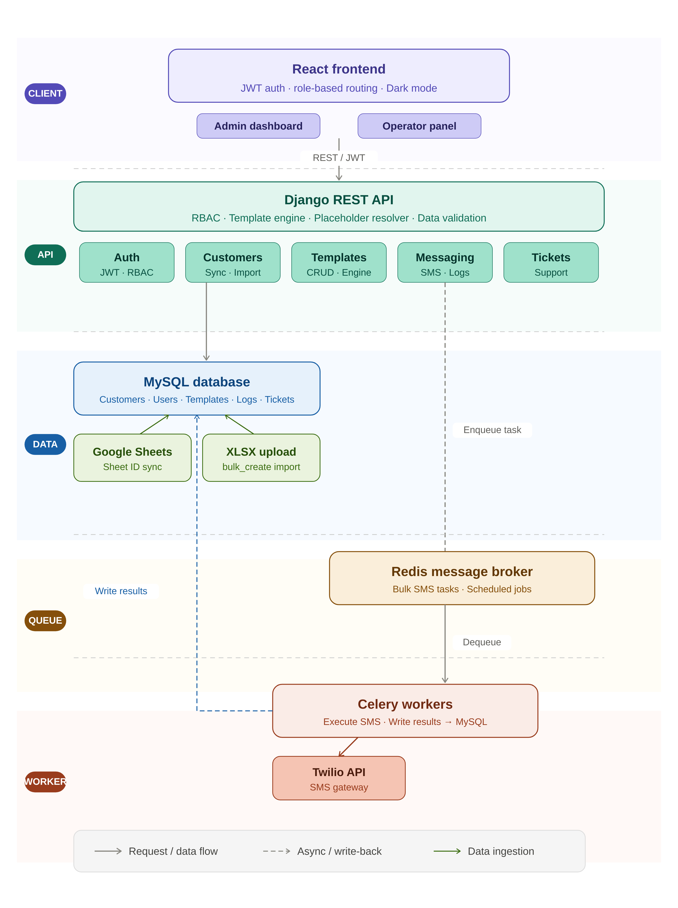

</div>

&nbsp;

**Bulk SMS request flow — step by step:**

```
Operator selects template
        ↓
Django resolves placeholders → generates preview for every customer
        ↓
Operator confirms → Django pushes job to Redis
        ↓
Celery worker dequeues → calls Twilio for each customer
        ↓
Delivery result (Logged / Failed) written back to MySQL
```

&nbsp;

---

&nbsp;


&nbsp;

---

&nbsp;

### API Endpoints & Data Models

<table>
  <tr>
    <th align="center">API Endpoints</th>
    <th align="center">Data Models</th>
  </tr>
  <tr>
    <td align="center"></td>
    <td align="center"></td>
  </tr>
</table>

&nbsp;

---

&nbsp;

### Dark Mode

<div align="center">

**Dark Mode — Full System-Wide Theme**

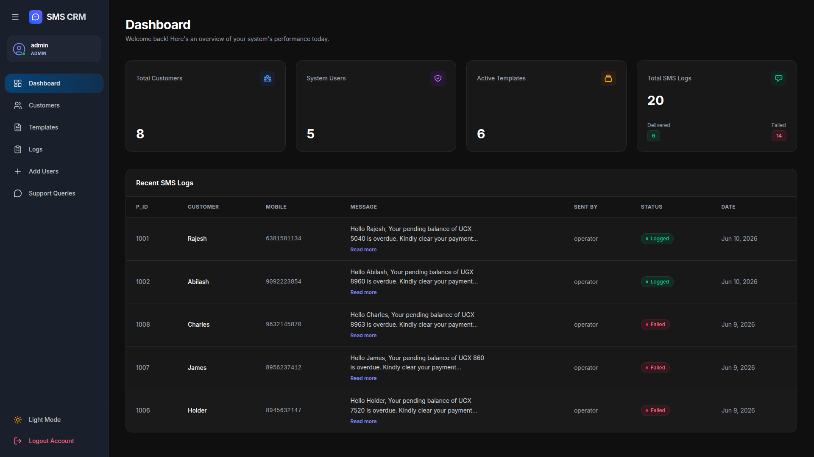

</div>

&nbsp;

---

&nbsp;

### Application Walkthrough

<table>
  <tr>
    <td align="center">
      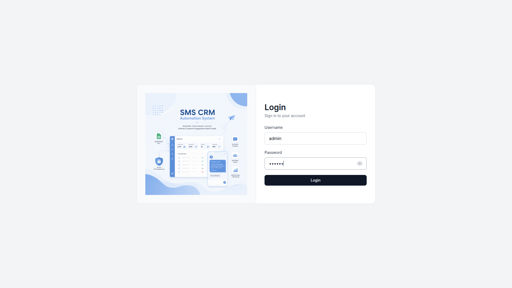<br/>
      <b> Login</b><br/>
      <sub>JWT-secured authentication portal</sub>
    </td>
    <td align="center">
      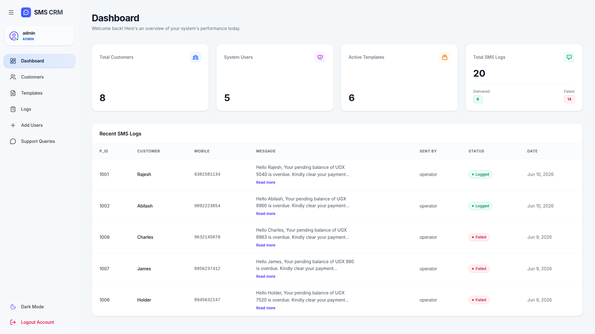<br/>
      <b> Admin Dashboard</b><br/>
      <sub>Live KPI cards and activity feed</sub>
    </td>
  </tr>
  <tr>
    <td align="center">
      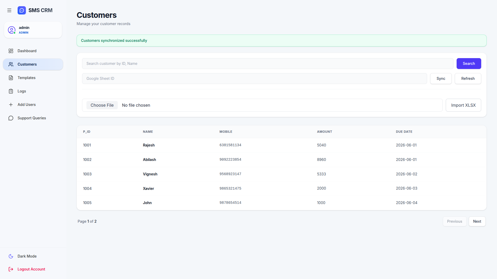<br/>
      <b> Customer Sync</b><br/>
      <sub>Google Sheets sync &amp; XLSX import</sub>
    </td>
    <td align="center">
      <br/>
      <b> SMS Templates</b><br/>
      <sub>Dynamic placeholder template engine</sub>
    </td>
  </tr>
  <tr>
    <td align="center">
      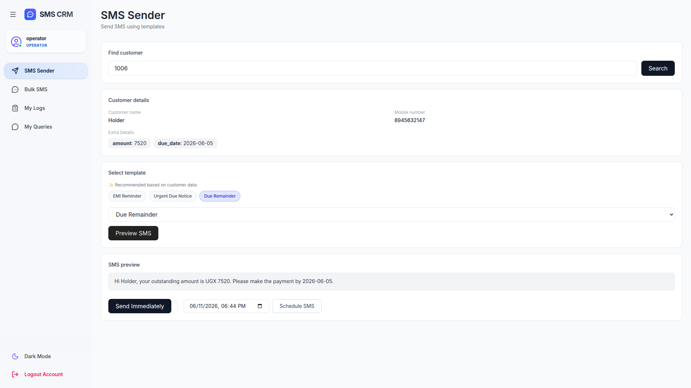<br/>
      <b> Single SMS Sender</b><br/>
      <sub>Live message preview before dispatch</sub>
    </td>
    <td align="center">
      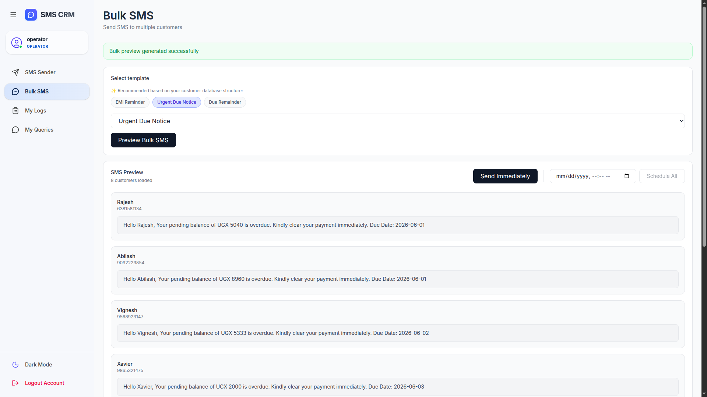<br/>
      <b>Bulk SMS</b><br/>
      <sub>Per-customer previews, async dispatch</sub>
    </td>
  </tr>
  <tr>
    <td align="center">
      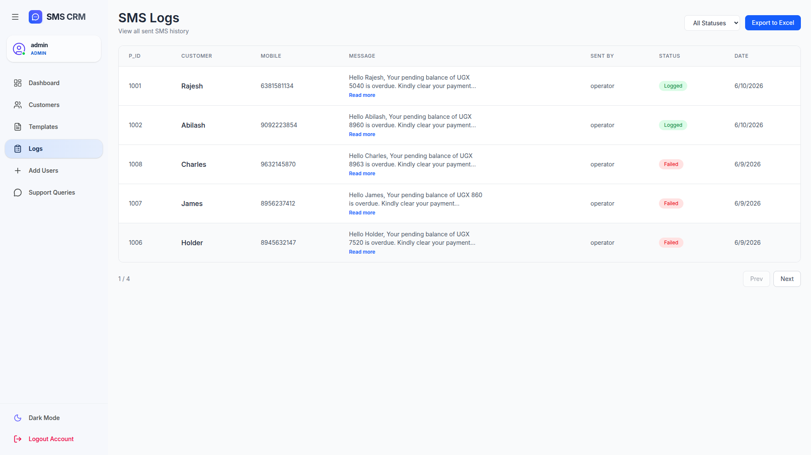<br/>
      <b>SMS Logs</b><br/>
      <sub>Full audit trail with export support</sub>
    </td>
    <td align="center">
      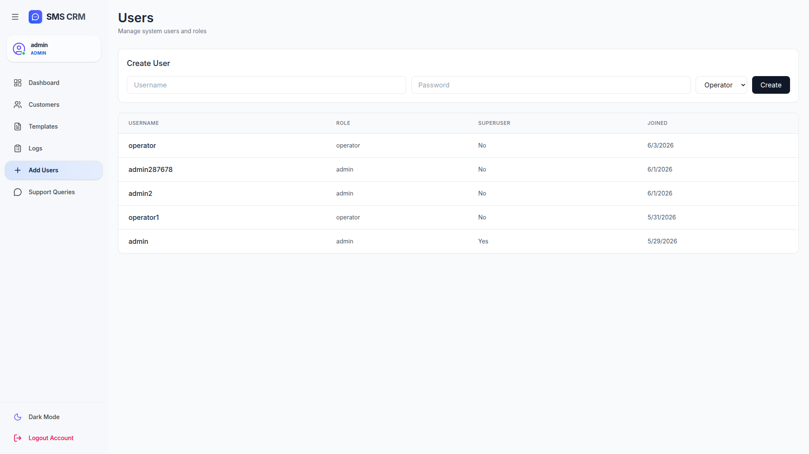<br/>
      <b> User Management</b><br/>
      <sub>Admin-only role and account control</sub>
    </td>
  </tr>
  <tr>
    <td align="center">
      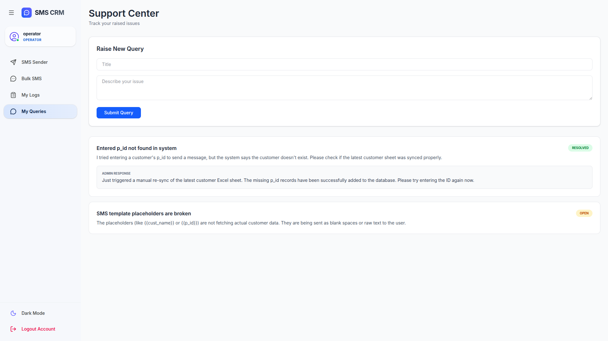<br/>
      <b>Operator Query</b><br/>
      <sub>Raise and track support queries</sub>
    </td>
    <td align="center">
      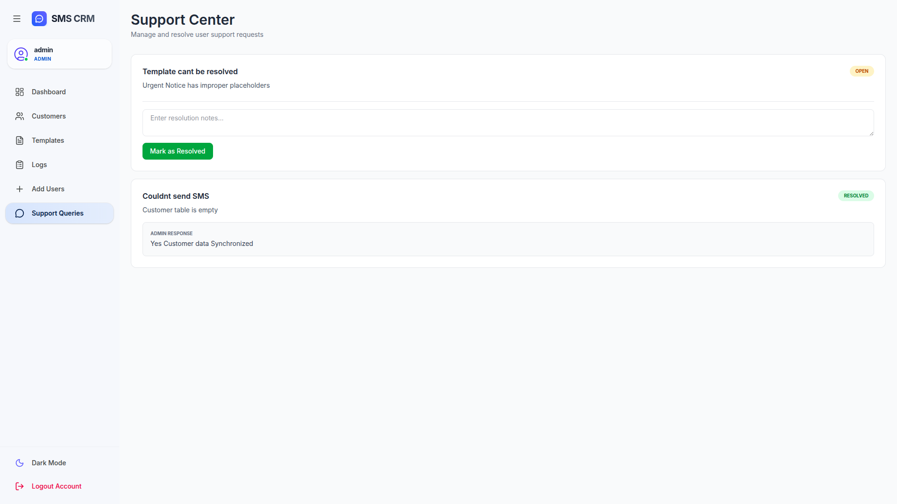<br/>
      <b> Support Queries</b><br/>
      <sub>Admin ticket resolution center</sub>
    </td>
  </tr>
  <tr>
    <td align="center">
      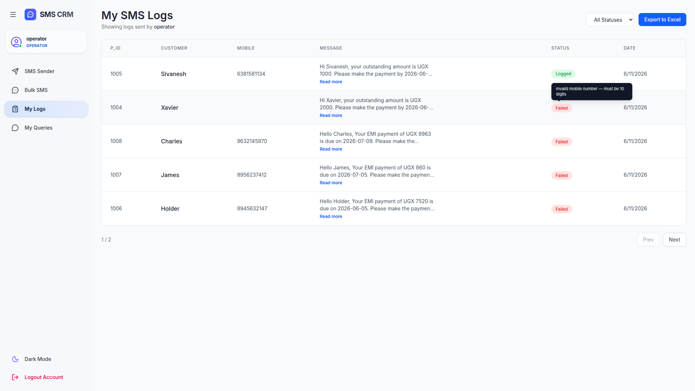<br/>
      <b>Operator Logs</b><br/>
      <sub>Personalized SMS logs</sub>
    </td>
  </tr>
</table>

&nbsp;

---

&nbsp;

## Modules

> *A breakdown of every feature built into the platform — what it does and how it works.*

&nbsp;

### 1. Authentication

JWT-based login portal with password visibility toggle. On successful login, the access token encodes the user's role and the frontend automatically routes them to the correct dashboard — Admin or Operator — with no extra round-trip.

&nbsp;

---

&nbsp;

### 2. Admin Dashboard

Central command center for the entire platform. Displays real-time KPI cards for:

- Total Customers in the database
- Total System Users
- Active SMS Templates
- Total SMS Logs dispatched

Includes a live **Delivered vs. Failed** breakdown and a recent activity feed — giving management full operational visibility without querying the database directly.

&nbsp;

---

&nbsp;

### 3. Customer Management

Searchable, paginated customer table with lookup by **Name** or **P_ID**.

**Two data ingestion methods:**

| Method | How It Works |
| :--- | :--- |
| **Google Sheets Sync** | Paste a Sheet ID → database syncs and replaces existing records instantly |
| **XLSX Upload** | Upload any `.xlsx` file → records bulk-imported via Django's `bulk_create` |

&nbsp;

**Hybrid Customer Schema — built for flexibility:**

The customer model separates universal identity fields from business-specific data:

| Column | Type | Description |
| :--- | :--- | :--- |
| `p_id` | Fixed | Unique customer identifier — required anchor field |
| `cust_name` | Fixed | Customer full name |
| `mobile_number` | Fixed | Destination phone number |
| `extra_fields` | JSON | Every other column — `amount`, `due_date`, `offer_code`, etc. |

Any column in the source sheet beyond the three fixed fields is automatically captured into the `extra_fields` JSON object at sync time. This means the system **adapts to any business's spreadsheet structure without touching the database schema** — and the template engine reads from `extra_fields` at send time to resolve all dynamic placeholders.

&nbsp;

---

&nbsp;

### 4. SMS Template Engine

Create and manage reusable message templates with dynamic placeholders. At send time, the engine merges each placeholder with the customer's fixed fields and `extra_fields` JSON — meaning **any column from the original sheet becomes a usable variable automatically**, with no code changes required.

| Placeholder | Resolves From |
| :--- | :--- |
| `$cust_name` | Fixed field — customer's full name |
| `$amount` | `extra_fields` — outstanding balance |
| `$leave_date` | `extra_fields` — due or leave date |
| `$offer_code` | `extra_fields` — promotional code |
| `$discount_rate` | `extra_fields` — discount percentage |

Full CRUD support — create, edit, delete. Templates power both the Single SMS and Bulk SMS flows.

&nbsp;

---

&nbsp;

### 5. Single SMS Sender

Lookup a customer by P_ID → the system auto-fills their name, mobile, and all account data. Select a template → a **live preview renders the fully resolved message** before any API call is made.

Smart template recommendations are surfaced automatically (e.g. EMI Reminder, Urgent Due Notice, Due Reminder) based on context. Choose to send immediately or schedule for a future time via Celery.

&nbsp;

---

&nbsp;

### 6. Bulk SMS Module

Select a template → the system generates a **fully resolved preview for every customer** in the database before a single Twilio API call is made. Operators review all messages, then dispatch immediately or schedule the entire batch.

Celery handles all execution in the background — the UI remains fully responsive regardless of how many customers are in the system.

&nbsp;

---

&nbsp;

### 7. SMS Logs

Complete, immutable audit trail for every outgoing message:

| Field | Description |
| :--- | :--- |
| `P_ID` | Customer identifier |
| `Customer` | Full name |
| `Mobile` | Destination number |
| `Message` | Exact text that was sent |
| `Sent By` | Operator username |
| `Status` | `Logged` ✅ / `Failed` ❌ |
| `Timestamp` | Date and time of dispatch |

Supports **status filtering**, **pagination**, and **one-click Excel export** for reporting.

&nbsp;

---

&nbsp;

### 8. User Management *(Admin Only)*

Create Operator or Admin accounts with username, password, and role assignment. View all system users with their role, superuser status, and account creation date. Full control over who can access the platform and at what permission level.

&nbsp;

---

&nbsp;

### 9. Support Ticketing System

An internal help desk built directly into the platform — no external tools needed.

**Operator side:** Raise a query with a title and description. Track query history, view admin responses, and monitor resolution status.

**Admin side:** Review all open tickets, add resolution notes, and mark issues as resolved — all from a dedicated support center view.

&nbsp;

---

&nbsp;

### 10. Dark Mode

Full dark theme across every surface — dashboard, cards, tables, sidebar, and forms — toggled system-wide. Designed for accessibility and a polished, production-ready look and feel.

&nbsp;

---

&nbsp;

## Local Setup

> *Get the full stack running locally in under 10 minutes.*

### Prerequisites

Make sure the following are installed on your machine before you begin:

| Dependency | Minimum Version | Notes |
| :--- | :--- | :--- |
| **Python** | `3.10+` | Used for Django backend and Celery workers |
| **Node.js** | `18+` | Required for the React frontend |
| **MySQL** | `8.0+` | Primary relational database |
| **Redis** | `6.0+` | Message broker for Celery task queue |

&nbsp;

### 1. Clone the Repository

```bash
git clone <your-repo-url>
cd SMS-AUTOMATION
```

&nbsp;

### 2. Backend Setup

```bash
cd backend

# Create and activate a virtual environment
python -m venv venv
source venv/bin/activate          # Windows: venv\Scripts\activate

# Install dependencies
pip install -r requirements.txt

# Configure environment variables
cp .env.example .env              # Fill in all values (see Environment Variables section)

# Run database migrations
python manage.py migrate

# Create an admin superuser
python manage.py createsuperuser
```

&nbsp;

**Start the backend services (3 separate terminals):**

```bash
# Terminal 1 — Django development server
python manage.py runserver

# Terminal 2 — Celery worker for background SMS tasks
celery -A core worker --loglevel=info

# Terminal 3 — Redis (if not running as a system service)
redis-server
```

&nbsp;

### 3. Frontend Setup

```bash
cd frontend

npm install
npm run dev
```

The app will be available at `http://localhost:5173` by default.

&nbsp;

---

&nbsp;

## Environment Variables

> *All secrets and configuration values live in a single `.env` file — never committed to source control.*

Create a `.env` file in the `/backend` directory. Use the reference below:

| Variable | Description |
| :--- | :--- |
| `TWILIO_ACCOUNT_SID` | Twilio account SID — found in your Twilio console |
| `TWILIO_AUTH_TOKEN` | Twilio auth token — found in your Twilio console |
| `TWILIO_PHONE_NUMBER` | Verified Twilio sender number (e.g. `+1234567890`) |

**Example `.env`:**

```env
TWILIO_ACCOUNT_SID=ACxxxxxxxxxxxxxxxxxxxxxxxxxxxxxxxx
TWILIO_AUTH_TOKEN=your_auth_token
TWILIO_PHONE_NUMBER=+1234567890
```

&nbsp;

---

&nbsp;

### Google Sheets API — `credentials.json` Setup

The Google Sheets sync feature requires a **service account credentials file** saved as `credentials.json` in the `/backend` directory. Follow these steps to generate it:

**Step 1 — Create a Google Cloud Project**

1. Go to [https://console.cloud.google.com](https://console.cloud.google.com)
2. Click **Select a project** → **New Project**
3. Give it a name (e.g. `sms-crm`) and click **Create**

&nbsp;

**Step 2 — Enable the Google Sheets API**

1. In your project, navigate to **APIs & Services** → **Library**
2. Search for **Google Sheets API** and click **Enable**
3. Also search for **Google Drive API** and click **Enable**

&nbsp;

**Step 3 — Create a Service Account**

1. Go to **APIs & Services** → **Credentials**
2. Click **+ Create Credentials** → **Service Account**
3. Fill in a name (e.g. `sms-crm-service`) and click **Create and Continue**
4. Under **Grant this service account access**, select the role **Editor** → click **Continue** → **Done**

&nbsp;

**Step 4 — Download the JSON Key**

1. On the **Credentials** page, click your newly created service account
2. Go to the **Keys** tab → **Add Key** → **Create new key**
3. Select **JSON** → click **Create**
4. A file will download automatically — **rename it to `credentials.json`**
5. Move it into your `/backend` directory:

```bash
mv ~/Downloads/<downloaded-file>.json backend/credentials.json
```

&nbsp;

**Step 5 — Share your Google Sheet with the Service Account**

1. Open the Google Sheet you want to sync
2. Click **Share** (top right)
3. Paste the service account email (found in `credentials.json` under `"client_email"`)
4. Set the role to **Viewer** (or **Editor** if write-back is needed) → click **Done**

&nbsp;

> **Note:** The `credentials.json` file contains sensitive keys. It is already listed in `.gitignore` — never commit it to version control.

&nbsp;

---

&nbsp;

## Project Structure

```
SMS-AUTOMATION/
│
├── assets/                          # Project screenshots and diagrams
│
├── backend/
│   ├── config/                      # Django project settings, root URLs, WSGI/ASGI
│   ├── customers/                   # Customer model, Google Sheets sync, XLSX import
│   ├── query/                       # Support ticketing — raise, respond, resolve
│   ├── services/                    # Shared service layer
│   │   ├── google_sheets_service.py # Google Sheets API integration
│   │   └── template_engine.py       # Placeholder resolver
│   ├── sms/                         # SMS dispatch logic, Celery tasks, audit log APIs
│   ├── templates_app/               # Template CRUD, placeholder resolution engine
│   ├── users/                       # JWT authentication, RBAC, user management APIs
│   ├── venv/                        # Python virtual environment
│   ├── .env                         # Environment variables (DB, Twilio, Redis, etc.)
│   ├── credentials.json             # Google service account credentials
│   ├── manage.py                    # Django management entry point
│   └── requirements.txt             # Python dependencies
│
└── frontend/
    ├── node_modules/
    ├── public/
    ├── src/
    │   ├── assets/
    │   ├── components/
    │   │   ├── Sidebar.jsx          # App-wide sidebar navigation
    │   │   └── XLSXUpload.jsx       # Excel file upload component
    │   ├── context/
    │   │   └── ThemeContext.jsx     # Dark/light mode context provider
    │   ├── layouts/
    │   │   └── MainLayout.jsx       # Shared page layout wrapper
    │   ├── pages/
    │   │   ├── admin/
    │   │   │   ├── CustomerPage.jsx      # Customer management view
    │   │   │   ├── DashboardPage.jsx     # Admin KPI dashboard
    │   │   │   ├── LogsPage.jsx          # System-wide SMS audit logs
    │   │   │   ├── TemplatesPage.jsx     # Template CRUD
    │   │   │   └── UsersPage.jsx         # User management
    │   │   ├── auth/
    │   │   │   └── LoginPage.jsx         # JWT login portal
    │   │   ├── operator/
    │   │   │   ├── BulkSMS.jsx           # Bulk SMS dispatch with previews
    │   │   │   ├── SmsSenderPage.jsx     # Single SMS sender
    │   │   │   └── OperatorLogsPage.jsx  # Personalized SMS history for the logged-in operator
    │   │   └── QueryPage.jsx             # Support query page (operator)
    │   ├── routes/
    │   │   ├── AppRoutes.jsx
    │   │   └── ProtectedRoute.jsx
    │   ├── services/
    │   │   └── api.js
    │   ├── App.css
    │   ├── App.jsx
    │   ├── index.css
    │   └── main.jsx
    ├── .gitignore
    ├── eslint.config.js
    ├── index.html
    ├── package-lock.json
    ├── package.json
    ├── README.md
    ├── tailwind.config.js
    └── vite.config.js
```

&nbsp;

---

&nbsp;

## Key Engineering Decisions

> *The reasoning behind the non-obvious choices — what drove each architectural decision and what problem it solves.*

&nbsp;

### Why Celery + Redis for bulk SMS dispatch?

Sending bulk SMS synchronously would block the HTTP request thread and cause a timeout on any send of meaningful size, leaving the UI frozen with no feedback. By handing the job off to Redis and processing it via Celery workers, the server responds instantly while thousands of messages execute reliably in the background. The delivery results are written back to MySQL by the worker — not the web process — keeping the two concerns cleanly separated.

&nbsp;

### Why enforce message previews before every send?

Twilio charges per message — a templating bug on a 500-customer bulk send is an expensive and irreversible mistake. Forcing operators to review fully resolved, per-customer previews before any API call is initiated is a deliberate **defensive design choice** that prevents both costly errors and incorrect communications reaching real customers.

&nbsp;

### Why JWT over session-based authentication?

The React frontend and Django backend are fully decoupled and served independently. JWT tokens carry the user's role in the payload, making stateless, role-based access control straightforward across both route-level guards on the frontend and permission decorators on every API endpoint — without any server-side session storage or coupling between services.

&nbsp;

### Why a hybrid customer schema (fixed columns + JSON `extra_fields`)?

Different businesses maintain different spreadsheet structures — one might track `amount` and `due_date`, another uses `offer_code` and `discount_rate`, and a third might have entirely custom fields. Hardcoding every possible column as a database field would make the system brittle and business-specific. Instead, the three universal identity fields (`p_id`, `cust_name`, `mobile_number`) are stored as fixed columns, and every other column from the source sheet is captured automatically into a JSON `extra_fields` field. The template engine resolves placeholders against both at runtime — making the entire platform **adaptable to any business's data structure out of the box**, with zero schema changes.

&nbsp;

---

&nbsp;

## Feature Checklist

> *Every capability shipped in the current version — tracked for transparency.*

| Feature | Status |
| :--- | :---: |
| JWT Authentication with Role Encoding | ✅ |
| Role-Based Access Control — Admin & Operator | ✅ |
| Admin Dashboard with Live KPI Cards | ✅ |
| Customer Management — Search & Pagination | ✅ |
| Google Sheets One-Click Sync | ✅ |
| XLSX Bulk Import | ✅ |
| Hybrid Customer Schema (Fixed + JSON `extra_fields`) | ✅ |
| SMS Template Engine with Dynamic Placeholders | ✅ |
| Single SMS with Live Preview | ✅ |
| Bulk SMS with Per-Customer Preview | ✅ |
| Scheduled SMS (Single & Bulk) | ✅ |
| Twilio API Integration | ✅ |
| Celery + Redis Async Background Processing | ✅ |
| Full SMS Audit Log (Logged / Failed) | ✅ |
| Excel Export of SMS Logs | ✅ |
| User Management (Admin Only) | ✅ |
| Support Ticketing — Operator → Admin | ✅ |
| Dark Mode (Full System-Wide Theme) | ✅ |
| Responsive CRM Layout | ✅ |

&nbsp;

---

&nbsp;

---